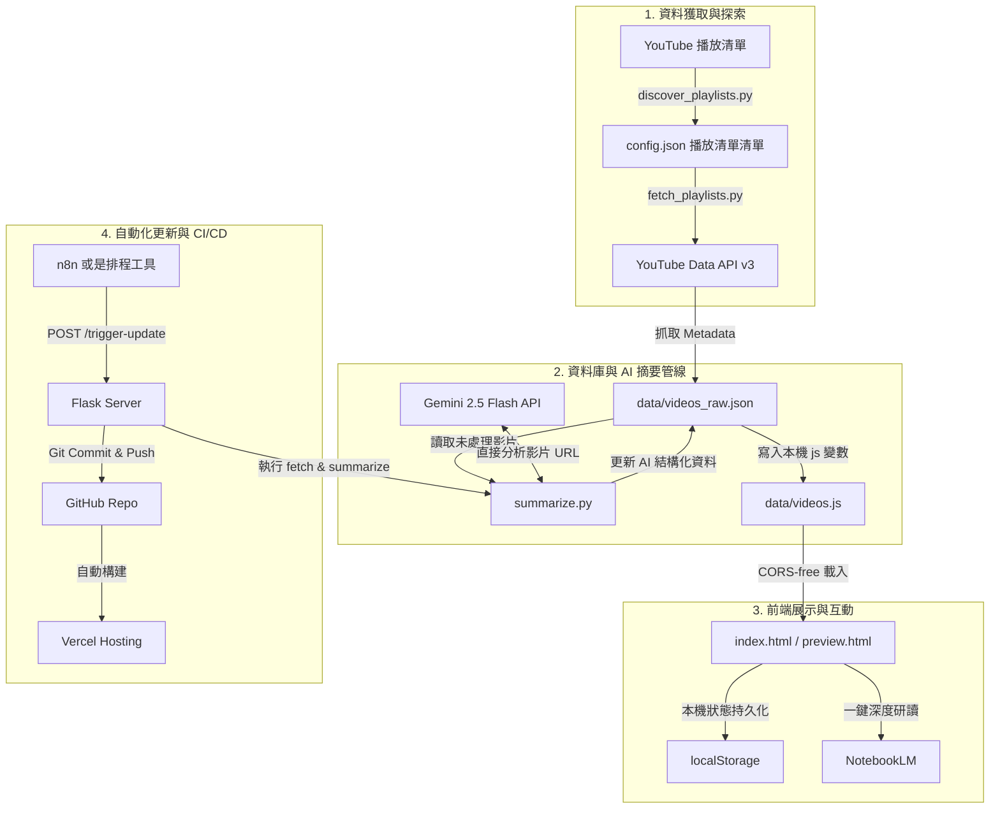

# 🎬 AI YouTube 影音知識庫 — 作品說明書
> **專案定位**：獨立全端開發專案 / AI-Powered YouTube Knowledge Base  
> **線上成果**：[ai-youtube-collection.vercel.app](https://ai-youtube-collection.vercel.app/)

---

## 一、 專案緣起 (Situation & Task)

### 1. 面臨痛點：資訊超載與「收藏不等於吸收」的學習矛盾
在 YouTube 上收藏了上百支高質量的 AI 技術與教學影片，這些影片分散在多達 13 個不同的播放清單中。然而，每天下班想要自我提升時，打開清單卻面臨嚴重的「選擇困難」：
* **資訊不透明**：無法在觀看前判斷這支影片是「純概念吹水」還是「有程式碼的實戰教學」？
* **評估成本高**：不知道這支影片有沒有討論到「生產環境的成本、延遲與可靠性」？若想知道，就必須親自點開並看上 15~30 分鐘，學習效率極低。
* **無效學習循環**：最終的結果常常是滑了 10 分鐘清單後，因為疲憊而乾脆放棄，轉去滑社群媒體，陷入「收藏影片 ➔ 堆積 ➔ 放棄觀看」的無效循環。

### 2. 解決方案：用 AI 整理 AI 影片，建立個人第二大腦
本專案的目的在於**用 AI 幫忙整理 AI 影片**。將不可控的學習負擔，轉化為一個**可篩選、可排序、可量化**的個人知識庫工作台。

### 3. 專案的雙重意義
* **實用價值**：切中個人痛點，能在觀看影片前快速過濾出「高落地實作度、有實作程式碼、且提及生產環境考量」的影片，大幅節省時間。
* **技術歷練**：作為**從石化產業成功跨足 AI 工程**的第一個端到端（end-to-end）實踐，將 LLM API 呼叫、Prompt 工程、無後端架構、自動化排程與 CI/CD 流程完整串接。

---

## 二、 系統架構 (System Architecture)

本系統採用 **輕量、Serverless、零維護成本** 的設計理念，其運作流程如下：

### 系統元件說明
1. **資料獲取**：`fetch_playlists.py` 透過 YouTube Data API v3 批次抓取影片標題、頻道、發布日期、時長與縮圖等元數據。
2. **AI 分析管線**：`summarize.py` 呼叫 Gemini 2.5 Flash API，利用其強大的多模態功能直接輸入 YouTube URL 進行內容分析。
3. **前端渲染**：前端使用 React 與 Tailwind CSS，以單一 HTML 檔案搭配 CDN 載入。影片資料以 `data/videos.js` 形式引入，徹底解決本機開啟 HTML 時的 `file://` CORS 跨域限制。
4. **自動化同步**：由 `server.py`（Flask）提供一個 API 端點。當接收到更新觸發時，會自動同步最新影片、跑 AI 摘要、並透過 Git 自動推送，觸發 Vercel 的自動部署。

### 系統操作示範錄影 (Demo Video)

下圖為自動化測試代理模擬用戶在該系統中的操作過程：
1. **多維度篩選**：點擊「RAG」、「Claude Code」資料夾與「實戰教學」分類，展示即時前端過濾。
2. **搜尋與重設**：輸入 "RAG" 關鍵字快速模糊搜尋，並清空還原。
3. **AI 摘要詳情**：打開影片卡片詳情彈窗（View），展示由 Gemini 產出的結構化摘要、關鍵重點與生產考量信號（討論成本/延遲/可靠性/評估/失敗模式等，影片明確討論者會高亮顯示）。
4. **筆記系統**：點擊卡片上的「📝」，可在本機透過 `localStorage` 撰寫並持久化儲存技術筆記。
5. **NotebookLM 深度研讀**：點擊「🧠」一鍵複製該影片 URL 並新開分頁跳轉至 Google NotebookLM，方便對影片進行深度的 RAG 問答。

---

## 三、 技術重點 (Technical Highlights)

### 1. Gemini 2.5 Flash 原生多模態 URL 解析（Game Changer）
* **技術痛點**：以往要用 AI 摘要影片，需要寫複雜的字幕爬蟲、處理無字幕影片的 OCR、甚至去接 Whisper 進行語音識別，不僅開發成本高，工程鏈條也很脆弱。
* **本專案解法**：利用 Google 新一代 `google-genai` SDK，Gemini 2.5 Flash **可以直接接受 YouTube 影片的 URL 作為多模態輸入**，在 Google 後端直接進行視聽內容解讀。這讓原先需要數天開發的複雜工程，縮減為僅 150 行的 Python 腳本，且單支影片的 AI 分析成本壓縮至 **$0.03 美元以下**。

### 2. 嚴格、保守的 Prompt 工程與結構化輸出
為了防止 LLM 常見的「幻覺（Hallucination）」與「過度解讀/吹捧」，本專案建立了非常嚴格的 Prompt 條件：
* **客觀的生產信號判定**：必須是影片「明確花費 30 秒以上專門討論」的面向（如：成本、延遲、可靠性、評估、失敗案例），對應的生產信號（`production_signals`）才能亮起，光是提到一句一律判定為 `false`。
* **落地度評分 (Practicality Score) 限制**：針對不同的內容類型（`content_type`）設定分數天花板（例如：理論講解 `theory` 上限 4 分，新聞 `news` 上限 2 分），避免 LLM 對純概念影片給予過高的實作分數。
* **JSON Schema 強制規範**：使用 `response_mime_type="application/json"` 強制 LLM 輸出符合約定 Schema 的結構化資料。

### 3. 長時間批次任務的容錯設計 (Resilience)
* **斷點續傳**：AI 摘要腳本在每處理完一支影片後就會立即儲存檔案。若中途發生網路中斷、Rate Limit 限制或人為 Ctrl+C 中止，下次重啟時會自動跳過已摘要的影片，確保不浪費任何 API 配額與金錢。
* **超長影片 Fallback**：針對超出 Token 限制的超長影片，設計了自動降級（Fallback）機制，寫入特定的錯誤標記，避免自動更新管線卡死。

### 4. 零成本與零維護的前端架構 (SaaS Style UI)
* **輕量無後端**：沒有資料庫、沒有打包工具（No Build Steps）。前端採用單檔 React + Tailwind CSS 配合 CDN。
* **資料持久化**：使用 `localStorage` 來記錄使用者的個人狀態，包括「看過/未看」的進度以及「個人技術筆記」。
* **NotebookLM 深度研讀整合**：新增一鍵複製影片 URL 並直接跳轉到 NotebookLM 的功能，無縫對接 Google 的個人 RAG 知識庫，方便使用者針對有興趣的影片進行深度對話。

---

## 四、 成果與學習 (Result & Learnings)

### 1. 具體成果
* **效率提升**：成功將 13 個雜亂的播放清單轉化為一個擁有「跨欄位關鍵字搜尋」與「多維度條件篩選（清單、類型、進度）」的學習平台，每日新影片的評估時間從 15 分鐘降至 10 秒鐘。
* **極低運作成本**：抓取 47 支影片（平均長度 25 分鐘）的 AI 處理總成本僅 **$1.27 美元**，後續每新增一支影片的邊際成本僅約 **$0.03 美元**。
* **CI/CD 自動化**：透過 Vercel 與 Flask Webhook API 的整合，成功打造出自動同步、自動部署的運作流程。

### 2. 核心學習與啟示
* **LLM 的「客觀性」需要被工程化限制**：若不加限制，LLM 會傾向於討好使用者並給出慷慨的評分與判定。只有在 Prompt 中設置嚴格的負向規則（Negative Rules）與評分天花板，才能獲得具備決策參考價值的數據。
* **Schema 先行，UI 後設計**：在動手開發前端前，先釐清並確定了 `videos.json` 的 Schema。這讓前端的 React state 設計與資料篩選邏輯變得極其清晰與輕量。
* **對長時間批次任務，「防錯與續傳」是第一要務**：外部 API 與網路環境充斥著不確定性，一個優秀的批次處理腳本必須具備「隨時中斷，隨時接續」的韌性。
